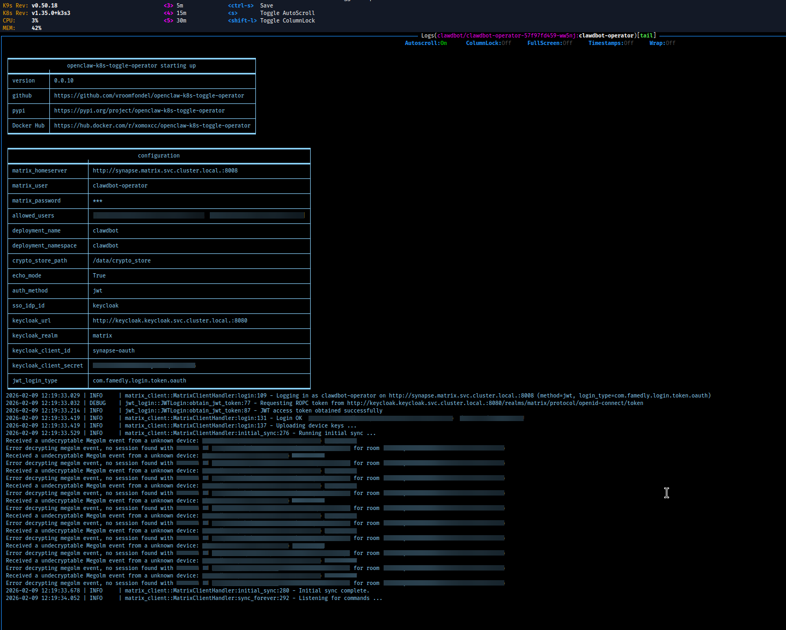

# openclaw-k8s-toggle-operator

[](https://github.com/vroomfondel/openclaw-k8s-toggle-operator/actions/workflows/checkblack.yml)
[](https://github.com/vroomfondel/openclaw-k8s-toggle-operator/actions/workflows/mypynpytests.yml)

[](https://hub.docker.com/r/xomoxcc/openclaw-k8s-toggle-operator/tags)
[](https://pepy.tech/projects/openclaw-k8s-toggle-operator)

[](https://hub.docker.com/r/xomoxcc/openclaw-k8s-toggle-operator)

Matrix-controlled Kubernetes deployment toggle operator. Connects to a Matrix
homeserver with E2E encryption and listens for chat commands to scale a K8s
deployment between 0 and 1 replicas.



Extracted from the inline `clawdbot_operator.py` ConfigMap in the
[Ansible infrastructure repo](https://github.com/vroomfondel/somestuff)
(`roles/kubectlstuff/files/clawdbot_operator.py`).

## Status

**Beta (v0.0.10)** — core Matrix bot with E2E encryption, K8s scaling, and
JWT authentication via Keycloak are implemented. Packaging, Docker multi-arch
images, and CI are in place.

## Bot Commands

Send these as plain text messages in a Matrix room with the bot (encrypted or unencrypted):

| Command | Action |
|---------|--------|
| `start` / `on` | Scale deployment to 1 replica |
| `stop` / `off` | Scale deployment to 0 replicas |
| `status` | Show deployment replica counts |
| `help` | Show available commands |

Only users listed in `ALLOWED_USERS` can send commands. The bot auto-accepts
room invitations from allowed users.

## Architecture

- Runs as a single-replica **Deployment** in a dedicated namespace
- Uses the **Kubernetes Python client** with in-cluster config to patch deployment scale
- Connects to Matrix via **matrix-nio** with E2E encryption (`libolm`)
- **TOFU device trust** — automatically trusts all devices of allowed users
- **Multiple auth methods** — password, SSO, or JWT via Keycloak (ROPC + JWKS)
- Crypto store must be on a **persistent volume** or the bot loses decryption keys on restart
- Auto-reconnect loop with exponential backoff (max 20 retries)

## Configuration

| Variable | Required | Default |
|----------|----------|---------|
| `MATRIX_HOMESERVER` | no | `http://synapse.matrix.svc.cluster.local:8008` |
| `MATRIX_USER` | **yes** | — |
| `MATRIX_PASSWORD` | **yes** | — |
| `ALLOWED_USERS` | **yes** | — (comma-separated full Matrix user IDs) |
| `DEPLOYMENT_NAME` | no | `clawdbot` |
| `DEPLOYMENT_NAMESPACE` | no | `clawdbot` |
| `CRYPTO_STORE_PATH` | no | `/data/crypto_store` |
| `ECHO_MODE` | no | `true` (echo user messages with lobster emoji before processing) |
| `LOGURU_LEVEL` | no | `DEBUG` |

## JWT Authentication

When `AUTH_METHOD=jwt` is set, the operator authenticates via Keycloak ROPC (Resource Owner Password Credentials) grant instead of direct Matrix password login. This enables centralized identity management through Keycloak while allowing non-interactive bot authentication.

See [HOWTO_MATRIX_KEYCLOAK_OAUTH.md](https://github.com/vroomfondel/openclaw-k8s-toggle-operator/blob/main/HOWTO_MATRIX_KEYCLOAK_OAUTH.md) for a step-by-step setup guide covering Keycloak client creation, Synapse configuration, and verification.

### Authentication Flow

```
Bot/Service                    Keycloak                         Synapse
    │                              │                                │
    │  1. ROPC grant               │                                │
    │  (username + password)       │                                │
    ├─────────────────────────────►│                                │
    │                              │                                │
    │  2. JWT access token         │                                │
    │◄─────────────────────────────┤                                │
    │                              │                                │
    │  3. Matrix login (JWT)       │                                │
    ├──────────────────────────────┼───────────────────────────────►│
    │                              │                                │
    │                              │  4. Validate JWT               │
    │                              │◄───────────────────────────────┤
    │                              │     (JWKS or introspection)    │
    │                              ├───────────────────────────────►│
    │                              │                                │
    │  5. Matrix access token      │                                │
    │◄─────────────────────────────┼────────────────────────────────┤
```

### Supported Login Types

| Login Type | Synapse Config | Validation Method | Use Case |
|------------|----------------|-------------------|----------|
| `com.famedly.login.token.oauth` (default) | synapse-token-authenticator `oauth:` | JWKS endpoint | **Recommended** — automatic key rotation |
| `com.famedly.login.token` | synapse-token-authenticator `jwt:` | Symmetric secret (HS512) | Internal services with shared secret |
| `org.matrix.login.jwt` | Native `jwt_config:` | Public key (RS256) | Simple setup, manual key management |

### Environment Variables

| Variable | Required | Default |
|----------|----------|---------|
| `AUTH_METHOD` | no | `password` |
| `KEYCLOAK_URL` | yes (if jwt) | — |
| `KEYCLOAK_REALM` | yes (if jwt) | — |
| `KEYCLOAK_CLIENT_ID` | yes (if jwt) | — |
| `KEYCLOAK_CLIENT_SECRET` | no | `""` (empty for public clients) |
| `JWT_LOGIN_TYPE` | no | `com.famedly.login.token.oauth` |

---

## Complete Setup Guide

This section describes the full setup for JWT authentication with Keycloak and Synapse.

### Prerequisites

- Keycloak instance (any recent version)
- Synapse homeserver
- Admin access to both Keycloak and Synapse

### Step 1: Keycloak Realm Setup

Create a dedicated realm for Matrix (or use an existing one). A dedicated realm simplifies user management since any user in the realm can authenticate to Matrix.

**Via Keycloak Admin Console:**
1. Navigate to **Realm Settings** → **Create Realm**
2. Set realm name (e.g., `matrix`)
3. Enable the realm

**Recommended realm settings:**
- `registrationAllowed: false` — disable self-registration (admin creates users)
- `loginWithEmailAllowed: false` — use usernames, not emails (Matrix localparts)
- `registrationEmailAsUsername: false` — important for Matrix username compatibility

### Step 2: Create OAuth Client for Bot Authentication

Create a **confidential client** with ROPC (Direct Access Grants) enabled. This client is used by bots and services to obtain JWT tokens via username/password.

**Via Keycloak Admin Console:**
1. Navigate to **Clients** → **Create Client**
2. Set Client ID (e.g., `synapse-oauth`)
3. Configure:
   - **Client authentication**: ON (confidential client)
   - **Authorization**: OFF
   - **Authentication flow**: Enable only **Direct access grants** (ROPC)
   - **Standard flow**: OFF (not needed for bots)
   - **Service accounts**: OFF (not needed)

**Key settings summary:**
| Setting | Value | Reason |
|---------|-------|--------|
| `publicClient` | `false` | Confidential client with secret |
| `clientAuthenticatorType` | `client-secret` | Use client secret for auth |
| `directAccessGrantsEnabled` | `true` | **Required** — enables ROPC grant |
| `standardFlowEnabled` | `false` | No browser redirects needed |
| `serviceAccountsEnabled` | `false` | Not using service account |

**After creation:**
1. Go to **Credentials** tab
2. Copy the **Client secret** — you'll need this for the bot configuration

### Step 3: Create Bot User in Keycloak

Create a user account for the bot in your Keycloak realm.

**Via Keycloak Admin Console:**
1. Navigate to **Users** → **Add user**
2. Set username (e.g., `clawdbot-operator`) — this becomes the Matrix localpart
3. Set email (optional)
4. Enable the user
5. Go to **Credentials** tab → **Set password**
6. Set a password and disable "Temporary"

**Important:** The Keycloak username must match the desired Matrix localpart. Synapse extracts the username from the `preferred_username` JWT claim.

### Step 4: Install synapse-token-authenticator

The [synapse-token-authenticator](https://github.com/famedly/synapse-token-authenticator) module adds additional login types to Synapse for JWT/OIDC authentication.

**Installation:**
```bash
pip install synapse-token-authenticator
```

**For Docker deployments**, add to your container startup:
```bash
pip install --no-cache-dir synapse-token-authenticator
```

Or create a custom Synapse image with the module pre-installed.

### Step 5: Configure Synapse

Add the synapse-token-authenticator module to your `homeserver.yaml`. The configuration depends on which login type(s) you want to support.

#### Option A: OAuth with JWKS Validation (Recommended)

**Login type:** `com.famedly.login.token.oauth`

This is the recommended configuration. Synapse validates JWT signatures against Keycloak's JWKS endpoint, enabling automatic key rotation.

```yaml
modules:
  - module: synapse_token_authenticator.TokenAuthenticator
    config:
      oauth:
        jwt_validation:
          # Keycloak JWKS endpoint for signature validation
          jwks_endpoint: "https://keycloak.example.com/realms/<realm>/protocol/openid-connect/certs"
          # JWT claim containing the Matrix localpart
          localpart_path: "preferred_username"
          # Require token expiry (recommended)
          require_expiry: true
          # Validator type: "exist" just checks the user exists
          validator:
            type: exist
        # Auto-register users on first login
        registration_enabled: true
```

**Advantages:**
- Automatic key rotation — no manual key updates when Keycloak rotates keys
- Standard OIDC/OAuth2 flow
- Works with any OIDC provider

#### Option B: JWT with Symmetric Secret

**Login type:** `com.famedly.login.token`

Uses a shared symmetric secret (HS512) for JWT validation. Simpler but requires secure secret distribution.

```yaml
modules:
  - module: synapse_token_authenticator.TokenAuthenticator
    config:
      jwt:
        # Shared secret (must match token signing key)
        secret: "your-256-bit-secret-here"
        algorithm: HS512
        # Don't auto-register users
        allow_registration: false
        # Require token expiry
        require_expiry: true
```

**Use case:** Internal services where you control both token generation and validation.

#### Option C: Native Synapse JWT (No Module Required)

**Login type:** `org.matrix.login.jwt`

Uses Synapse's built-in JWT support with the realm's RSA public key.

**Get the realm public key:**
```bash
curl -s "https://keycloak.example.com/realms/<realm>" | jq -r '.public_key'
```

**Add to `homeserver.yaml`:**
```yaml
jwt_config:
  enabled: true
  secret: |
    -----BEGIN PUBLIC KEY-----
    <paste the public key here>
    -----END PUBLIC KEY-----
  algorithm: "RS256"
  subject_claim: "preferred_username"
  issuer: "https://keycloak.example.com/realms/<realm>"
```

**Disadvantages:**
- Manual key management — must update `homeserver.yaml` when Keycloak rotates keys
- No automatic key rotation

#### Combined Configuration (All Methods)

You can enable multiple authentication methods simultaneously:

```yaml
modules:
  - module: synapse_token_authenticator.TokenAuthenticator
    config:
      # Option A: OAuth/JWKS (com.famedly.login.token.oauth)
      oauth:
        jwt_validation:
          jwks_endpoint: "https://keycloak.example.com/realms/<realm>/protocol/openid-connect/certs"
          localpart_path: "preferred_username"
          require_expiry: true
          validator:
            type: exist
        registration_enabled: true

      # Option B: Symmetric JWT (com.famedly.login.token)
      jwt:
        secret: "your-256-bit-secret-here"
        algorithm: HS512
        allow_registration: false
        require_expiry: true

      # Option C: OIDC Token Introspection (com.famedly.login.token.oidc)
      # For real-time token validation (slower but supports revocation)
      oidc:
        issuer: "https://keycloak.example.com/realms/<realm>"
        client_id: "synapse"
        client_secret: "your-oidc-client-secret"
        allow_registration: true
```

### Step 6: Restart Synapse

After updating `homeserver.yaml`, restart Synapse to load the new configuration.

### Step 7: Test the Setup

Use the included test script to verify the JWT authentication flow:

```bash
KEYCLOAK_URL=https://keycloak.example.com \
KEYCLOAK_REALM=matrix \
KEYCLOAK_CLIENT_ID=synapse-oauth \
KEYCLOAK_CLIENT_SECRET=your-client-secret \
MATRIX_USER=clawdbot-operator \
MATRIX_PASSWORD=your-password \
MATRIX_HOMESERVER=https://matrix.example.com \
ALLOWED_USERS=@admin:matrix.example.com \
./test-jwt-login.sh
```

The script performs:
1. **Step 1:** Obtains JWT from Keycloak via ROPC grant
2. **Step 2:** Decodes and displays JWT claims (for debugging)
3. **Step 3:** Tests Matrix login via the configured login type

**Test different login types:**
```bash
# Test OAuth/JWKS (default)
./test-jwt-login.sh

# Test symmetric JWT
./test-jwt-login.sh --login-type com.famedly.login.token

# Test native Synapse JWT
./test-jwt-login.sh --login-type org.matrix.login.jwt

# Test password auth (skip Keycloak)
./test-jwt-login.sh --auth-method password
```

### test-jwt-login.sh Reference

**Command-line options:**

| Option | Description | Default |
|--------|-------------|---------|
| `-t, --login-type TYPE` | JWT login type | `com.famedly.login.token.oauth` |
| `-m, --auth-method TYPE` | Auth method (`password` or `jwt`) | `jwt` |
| `-s, --skip-decode` | Skip JWT decoding step | `false` |
| `-v, --verbose` | Show detailed output including full responses | `false` |
| `-h, --help` | Show help message | — |

**Exit codes:**

| Code | Meaning |
|------|---------|
| 0 | All tests passed |
| 1 | Configuration error (missing environment variables) |
| 2 | Keycloak token request failed |
| 3 | JWT decode failed |
| 4 | Matrix login failed |

**Notes:**
- The script auto-detects the local `.venv` directory for running `connectortest`
- For password auth (`-m password`), Keycloak variables are not required
- Use `-v` (verbose) to see full HTTP responses when debugging failures

---

## Comparison: Login Types

| Feature | `com.famedly.login.token.oauth` | `com.famedly.login.token` | `org.matrix.login.jwt` |
|---------|--------------------------------|---------------------------|------------------------|
| Key management | Automatic (JWKS) | Manual (shared secret) | Manual (public key) |
| Key rotation | Automatic | Manual secret update | Manual config update |
| Algorithm | RS256 (asymmetric) | HS512 (symmetric) | RS256 (asymmetric) |
| Module required | Yes | Yes | No |
| Token revocation | Via introspection mode | No | No |
| Setup complexity | Medium | Low | Low |
| **Recommended for** | **Production** | Internal services | Simple setups |

---

## Troubleshooting

### Common Issues

**"Invalid username or password" from Synapse:**
- Verify the Keycloak user exists and password is correct
- Check that `preferred_username` in JWT matches an existing Matrix user (or `registration_enabled: true`)
- Verify JWKS endpoint is accessible from Synapse

**"ROPC grant failed" from Keycloak:**
- Ensure `directAccessGrantsEnabled: true` on the client
- Verify client secret is correct
- Check user is enabled in Keycloak

**"JWT signature validation failed":**
- For JWKS: verify the endpoint URL is correct and accessible
- For native JWT: ensure public key is correctly formatted with PEM headers
- Check `issuer` matches the JWT `iss` claim

### Useful Keycloak Endpoints

| Endpoint | Purpose |
|----------|---------|
| `/realms/<realm>/.well-known/openid-configuration` | OIDC discovery document |
| `/realms/<realm>/protocol/openid-connect/certs` | JWKS endpoint (public keys) |
| `/realms/<realm>/protocol/openid-connect/token` | Token endpoint (ROPC) |
| `/realms/<realm>` | Realm info (includes public key) |

## Kubernetes Deployment

### RBAC

The operator requires a ServiceAccount with a Role scoped to the target namespace:

```yaml
apiVersion: v1
kind: ServiceAccount
metadata:
  name: openclaw-toggle-operator
  namespace: clawdbot
---
apiVersion: rbac.authorization.k8s.io/v1
kind: Role
metadata:
  name: openclaw-toggle-operator
  namespace: clawdbot
rules:
  - apiGroups: ["apps"]
    resources: ["deployments", "deployments/scale"]
    verbs: ["get", "patch"]
---
apiVersion: rbac.authorization.k8s.io/v1
kind: RoleBinding
metadata:
  name: openclaw-toggle-operator
  namespace: clawdbot
roleRef:
  apiGroup: rbac.authorization.k8s.io
  kind: Role
  name: openclaw-toggle-operator
subjects:
  - kind: ServiceAccount
    name: openclaw-toggle-operator
    namespace: clawdbot
```

### Deployment

```yaml
apiVersion: apps/v1
kind: Deployment
metadata:
  name: openclaw-toggle-operator
  namespace: clawdbot
spec:
  replicas: 1
  selector:
    matchLabels:
      app: openclaw-toggle-operator
  template:
    metadata:
      labels:
        app: openclaw-toggle-operator
    spec:
      serviceAccountName: openclaw-toggle-operator
      containers:
        - name: operator
          image: xomoxcc/openclaw-k8s-toggle-operator:latest
          env:
            - name: MATRIX_USER
              value: "clawdbot-operator"
            - name: MATRIX_PASSWORD
              valueFrom:
                secretKeyRef:
                  name: openclaw-toggle-operator
                  key: matrix-password
            - name: ALLOWED_USERS
              value: "@henning:matrix.example.com,@openclaw:matrix.example.com"
            # - name: MATRIX_HOMESERVER
            #   value: "http://synapse.matrix.svc.cluster.local:8008"  # default
            # - name: DEPLOYMENT_NAME
            #   value: "clawdbot"                                      # default
            # - name: DEPLOYMENT_NAMESPACE
            #   value: "clawdbot"                                      # default
            # - name: CRYPTO_STORE_PATH
            #   value: "/data/crypto_store"                            # default
            # - name: ECHO_MODE
            #   value: "true"                                          # default
          volumeMounts:
            - name: crypto-store
              mountPath: /data/crypto_store
          resources:
            requests:
              cpu: 50m
              memory: 64Mi
            limits:
              cpu: 500m
              memory: 128Mi
      volumes:
        - name: crypto-store
          persistentVolumeClaim:
            claimName: openclaw-toggle-operator-crypto
```

## Installation

### From PyPI

```bash
pip install openclaw-k8s-toggle-operator
```

### From source

```bash
git clone https://github.com/vroomfondel/openclaw-k8s-toggle-operator.git
cd openclaw-k8s-toggle-operator
make venv
source .venv/bin/activate
pip install .
```

### Docker

```bash
docker build -t openclaw-k8s-toggle-operator .
```

Or via Makefile:

```bash
make docker
```

### Multi-arch build script

`build-container-multiarch.sh` builds and pushes multi-arch images (amd64 + arm64).

```bash
./build-container-multiarch.sh              # login + full multi-arch build & push
./build-container-multiarch.sh onlylocal    # login + local-only build (no push)
./build-container-multiarch.sh login        # Docker Hub login only
```

## Usage

```bash
# Run directly
openclaw-k8s-toggle-operator

# Or via Python module
python -m openclaw_k8s_toggle_operator
```

### Connectivity test

Test Matrix homeserver connectivity without starting the full operator
(useful as a pre-flight check or container readiness probe):

```bash
# Via console script (after pip install)
openclaw-k8s-toggle-operator-conntest

# Via Python module
python -m openclaw_k8s_toggle_operator conntest
```

Exits 0 on successful login, 1 on failure. Only tests Matrix — does not
require in-cluster K8s access.

## Scripts

### `scripts/blurimage.py` — OCR-based screenshot redaction

Blurs sensitive text in terminal/K9s screenshots using Tesseract OCR. Designed for redacting secrets, usernames, session IDs, device IDs, and other sensitive information before sharing screenshots.

**Features:**
- **Multi-pass OCR** with three preprocessing strategies (weighted grayscale, max-channel, blue-channel) to handle colored terminal text on dark backgrounds
- **OTSU thresholding** for clean black/white separation instead of naive inversion
- **Upscaling** (default 2x) for better recognition of small monospaced fonts
- **Two-level matching**: word-level (single tokens) and line-level (multi-word patterns), with targeted blurring that only redacts the matched words, not entire lines
- **Literal and regex patterns**: `--blur` for case-insensitive literal phrases, `--blur-regex` for case-sensitive regex patterns

**Dependencies:** `tesseract-ocr` (system), `pytesseract` + `opencv-python` (auto-installed)

**Usage:**
```bash
# Blur usernames, domain, client secret, session IDs, and device IDs
python scripts/blurimage.py \
  --blur matrixadmin henning elasticc.io \
  --blur-regex "rVFe\S+" "session id \S+" "[A-Z]{8,}" \
  screenshot.png

# Debug mode — show what Tesseract detects
python scripts/blurimage.py --debug --blur myuser screenshot.png

# Skip inversion for light-background images
python scripts/blurimage.py --no-invert --blur myuser screenshot.png

# Higher upscaling for very small text (slower)
python scripts/blurimage.py --scale 3 --blur myuser screenshot.png
```

**Pattern types:**

| Argument | Case sensitivity | Description |
|----------|-----------------|-------------|
| `--blur` | case-insensitive | Literal phrases, auto-escaped for regex safety |
| `--blur-regex` | case-sensitive | Raw regex patterns (add `(?i)` in pattern for case-insensitive) |
| *(hardcoded)* | case-insensitive | `PXL*`, `*.png`, `*.jpg`, `*.mp4`, `*.json` filenames |

See the module docstring in `scripts/blurimage.py` for a detailed explanation of the preprocessing pipeline, multi-pass OCR strategy, and two-level matching approach.

---

## Development

### Makefile targets

| Target          | Description                                  |
|-----------------|----------------------------------------------|
| `make venv`     | Create virtualenv and install all dependencies |
| `make tests`    | Run pytest                                   |
| `make lint`     | Format code with black (line length 120)     |
| `make isort`    | Sort imports with isort                      |
| `make tcheck`   | Static type checking with mypy               |
| `make commit-checks` | Run pre-commit hooks on all files      |
| `make prepare`  | Run tests + commit-checks                    |
| `make pypibuild`| Build sdist + wheel with hatch               |
| `make pypipush` | Publish to PyPI with hatch                   |
| `make docker`   | Build Docker image                           |

## License

[GNU Lesser General Public License v3](LICENSE.md)
